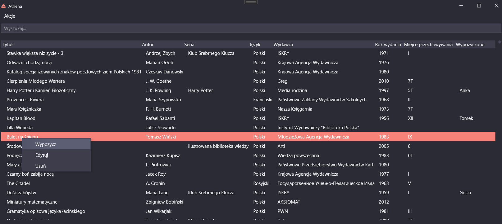
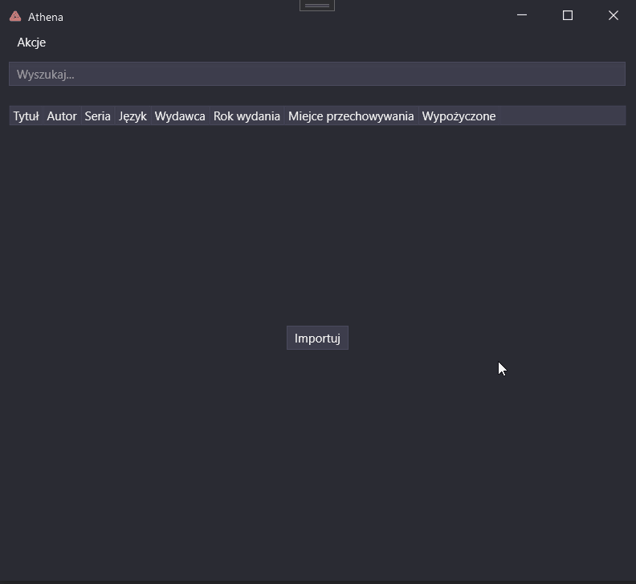
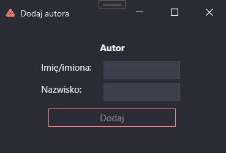
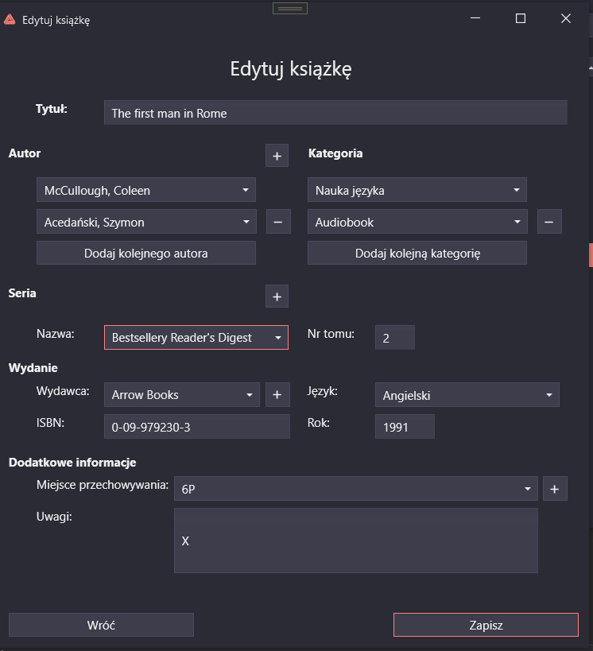
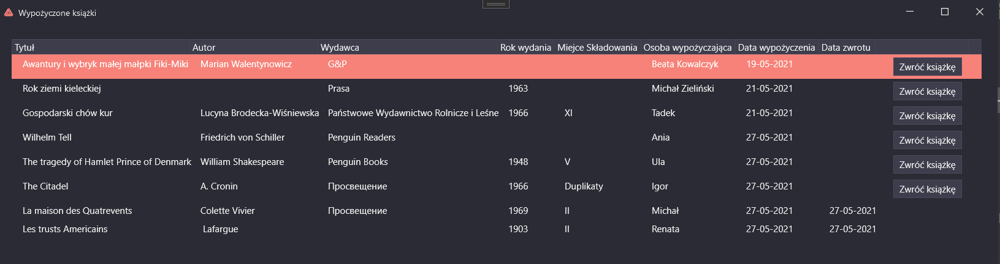
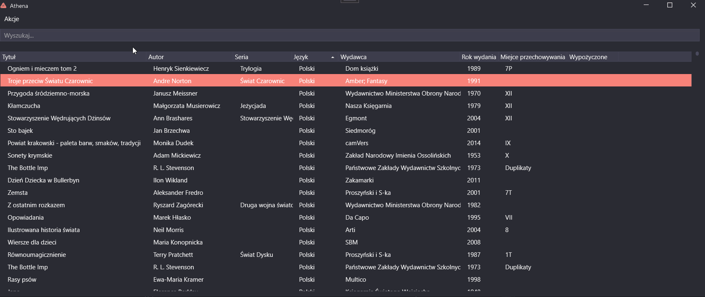

# Athena
An application that supports the home database of books, created using WPF, C# 8.0, and .Net 5.0.

### Features
#### Import

It is possible to import a previously prepared excel file as well as add single books. 

#### Adding elements

You can create your database of authors, series, publishers, and storage locations.

#### Books management

It is not only possible to add and remove books, but also to edit them.

#### Books borrowing

Athena also supports borrowing options as well as books' returns.

#### Searching

You can search by title, author, series, publisher, and category.

### Usage

1. [Download file]()
2. Unpack it
3. Choose file <b>Athena</b>
4. Enjoy :)

### Authors

<b>MossPiglets</b> 
* [Hubert Morawski](https://github.com/Morasiu) 
* [Katarzyna Kądziołka](https://github.com/Katarzyna-Kadziolka) 
* [Krystyna Szybalska](https://github.com/Krystyna-Szybalska) 
* [Zofia Szybalska](https://github.com/Zofia-Szybalska)

### License
This project is licensed under the MIT License - see the [LICENSE](LICENSE) file for details
